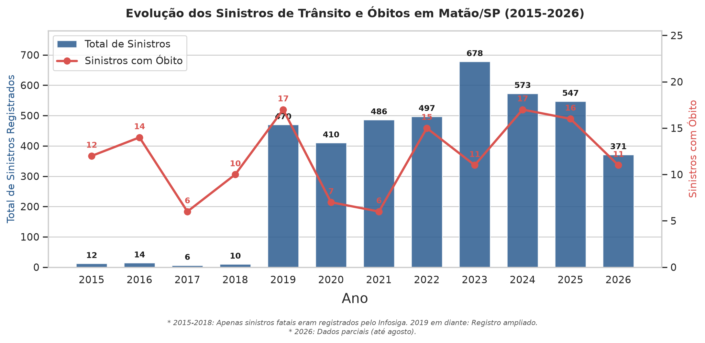
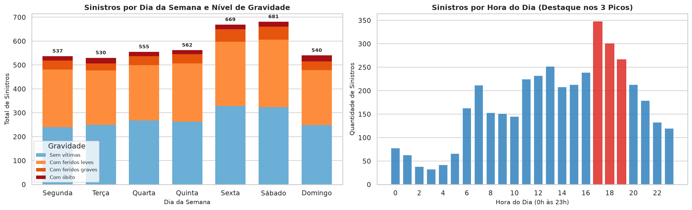
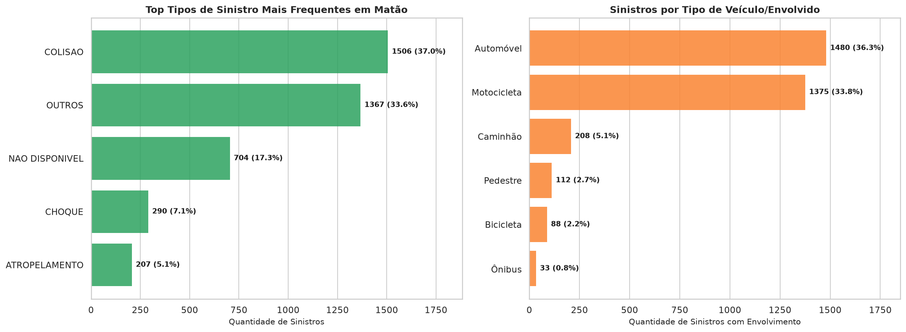
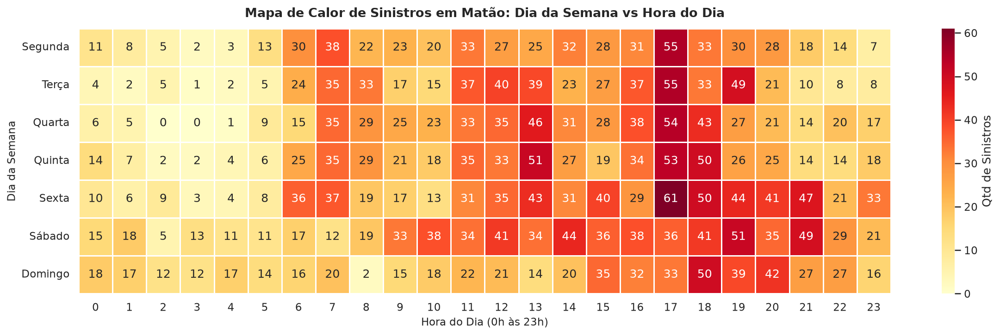
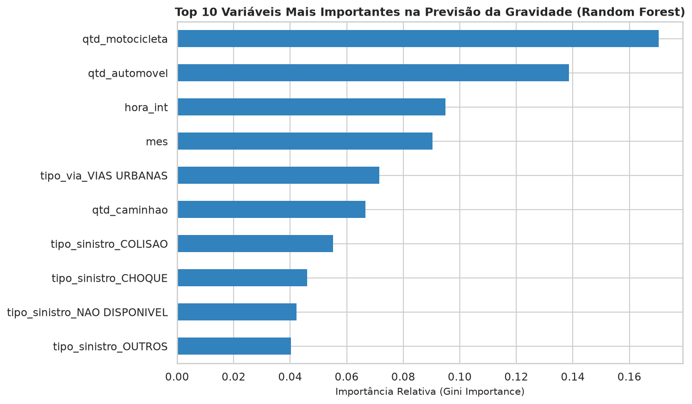

# 🚦 Análise e Diagnóstico de Acidentes de Trânsito em Matão/SP (2015–2026)

[](https://www.python.org/)
[](https://pandas.pydata.org/)
[](https://scikit-learn.org/)
[](https://plotly.com/)
[]()

Estudo completo de Ciência de Dados sobre os sinistros de trânsito ocorridos no município de **Matão/SP** ao longo de mais de 11 anos (março de 2015 a agosto de 2026). O projeto abrange desde a ingestão otimizada de dados estaduais volumosos até modelagem preditiva supervisionada de gravidade e visualização geoespacial interativa.

---

## 📌 Sumário Executivo

- **Fonte de Dados:** Infosiga SP (Movimento Paulista de Segurança no Trânsito / Governo do Estado de SP).
- **Volume Consolidado:** **4.074 sinistros** registrados em Matão (`cod_ibge == 3529302`), com **3.648 acidentes georreferenciados válidos**.
- **Otimização de Memória:** Pipeline de ingestão em lotes (*chunks*) que reduziu quase 400 MB de dados brutos estaduais para um dataset final limpo de **788 KB**.
- **Descoberta Central de Risco:** Choques contra obstáculos fixos (postes, árvores) possuem a maior taxa de letalidade (**14,14%**), quase 4 vezes superior à colisão veicular.
- **Preditor #1 de Severidade:** A presença de **motocicletas** despontou como a variável mais determinante para acidentes com lesões graves ou morte (Gini Importance ~ 0,17).
- **Pico Temporal:** O intervalo entre **17h e 19h** (saída de fábricas e comércio) concentra o maior volume de colisões da cidade.

---

## 📂 Estrutura do Projeto

```text
projeto-acidentes-matao/
│
├── data/
│   ├── sinistros_2015-2021.csv        # Dado bruto estadual (Infosiga)
│   ├── sinistros_2022-2024.csv        # Dado bruto estadual (Infosiga)
│   ├── sinistros_2025-2026.csv        # Dado bruto estadual (Infosiga)
│   └── matao_limpo.csv                # Dataset tratado consolidado (2015-2026)
│
├── notebooks/
│   ├── 01-exploracao.ipynb            # Leitura diagnóstica, chunks e auditoria de nulos
│   ├── 02-limpeza.ipynb               # Unificação de períodos, tipos e feature engineering
│   ├── 03-analise-matao.ipynb         # EDA temporal, modais, teste t e Machine Learning
│   └── 04-visualizacoes.ipynb         # Mapeamento geoespacial interativo (Plotly Carto)
│
├── output/
│   ├── graficos/                      # Figuras PNG de alta resolução e mapa HTML
│   │   ├── acidentes_por_ano.png
│   │   ├── acidentes_dia_e_hora.png
│   │   ├── tipos_e_veiculos.png
│   │   ├── heatmap_dia_hora.png
│   │   ├── importancia_features_ml.png
│   │   └── mapa_acidentes.html
│   └── relatorios/
│       ├── relatorio_final_matao.md   # Relatório técnico-executivo completo
│       └── resumo_anual_matao.csv     # Tabela anual agregada de vítimas
│
├── requirements.txt                   # Dependências do projeto
└── README.md                          # Este arquivo
```

---

## 📊 Principais Resultados e Visualizações

### 1. Evolução Histórica Anual (2015–2026)
A análise temporal revelou um marco metodológico essencial: até 2018 o Infosiga registrava exclusivamente fatalidades; a partir de 2019, o registro foi ampliado para sinistros não fatais. A série de óbitos, no entanto, é contínua e estável entre 6 e 17 mortes por ano em Matão.



---

### 2. Padrões de Horário e Dias da Semana
O final da tarde (17h–19h) concentra a maior sobrecarga no trânsito local. Um teste de hipótese (*Student's t-test*) comprovou que a média diária de acidentes é estatisticamente idêntica entre dias úteis (**2,03 acidentes/dia**) e fins de semana (**2,04 acidentes/dia**), com $p\text{-valor} = 0,76$.



---

### 3. Modais e a Letalidade por Tipo de Sinistro
Automóveis (36,3%) e Motocicletas (33,8%) dividem o protagonismo dos sinistros. Contudo, a análise de letalidade revela o perigo do choque contra obstáculo fixo:



| Tipo de Sinistro | Total de Casos | Óbitos | Feridos Graves | Taxa de Letalidade (%) |
| :--- | :---: | :---: | :---: | :---: |
| **CHOQUE** | 290 | 41 | 34 | **14,14%** |
| **ATROPELAMENTO** | 207 | 16 | 26 | **7,73%** |
| **COLISÃO** | 1.506 | 58 | 176 | **3,85%** |
| **OUTROS** | 1.367 | 24 | 45 | **1,76%** |

---

### 4. Matriz de Calor: Dia da Semana vs Hora do Dia
Identificação visual das "zonas quentes" da rotina do município.



---

### 5. Modelo Preditivo (Random Forest)
Treinamento de um classificador supervisionado com balanceamento de pesos de classe (`class_weight='balanced'`), atingindo **79% de acurácia global**. O ranking de importância de variáveis comprovou empiricamente que a **motocicleta é a variável que mais governa a severidade do acidente**.



---

### 6. Mapeamento Geoespacial Interativo
Construído com **Plotly** e renderizado sobre o estilo **Carto Positron**, mapeando 3.648 sinistros. O mapa comprova que enquanto a área urbana concentra feridos leves e danos materiais, os eixos das rodovias **SP-310 (Washington Luís)** e **SP-326 (Faria Lima)** concentram a grande maioria das fatalidades (pontos vermelhos).

> 🗺️ **Acesse o mapa interativo:** Abra o arquivo `output/graficos/mapa_acidentes.html` diretamente no seu navegador.

---

## 🛠️ Como Reproduzir este Projeto

### 1. Clonar o repositório e criar o ambiente virtual:
```bash
git clone https://github.com/seu-usuario/projeto-acidentes-matao.git
cd projeto-acidentes-matao

python -m venv .venv
source .venv/bin/activate  # No Windows: .venv\Scripts\activate
```

### 2. Instalar as dependências:
```bash
pip install -r requirements.txt
```

### 3. Execução dos Notebooks:
Execute os notebooks na ordem cronológica de desenvolvimento:
1. `notebooks/01-exploracao.ipynb`
2. `notebooks/02-limpeza.ipynb`
3. `notebooks/03-analise-matao.ipynb`
4. `notebooks/04-visualizacoes.ipynb`

---

## 📄 Relatório Técnico Completo
O diagnóstico formal detalhado, acompanhado de recomendações viárias para a gestão pública e análise de limitações de dados, está disponível no documento:
👉 [`output/relatorios/relatorio_final_matao.md`](output/relatorios/relatorio_final_matao.md)
